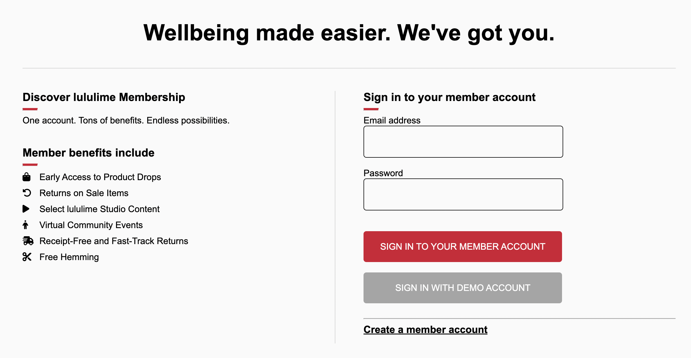
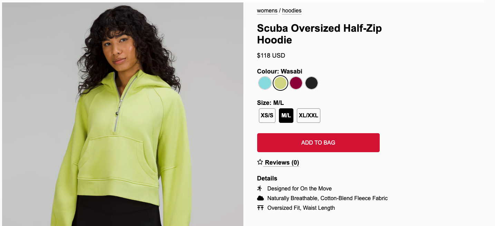
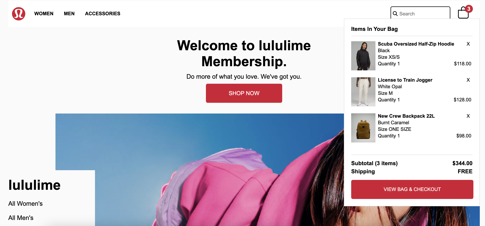
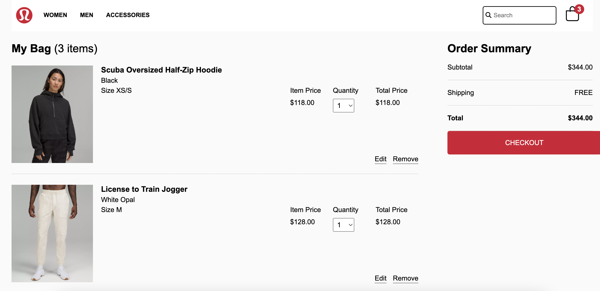
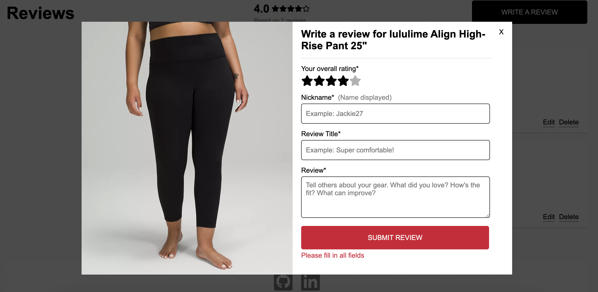
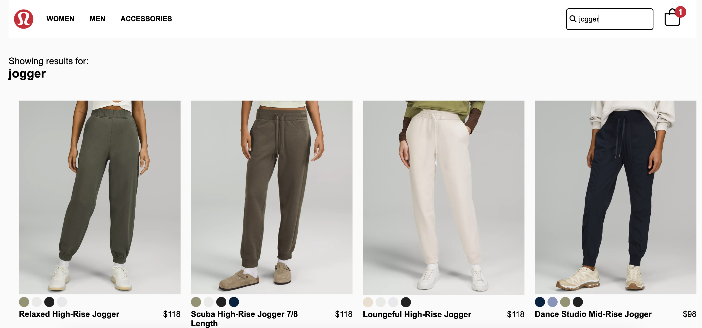

# Lululime

Live Site: [Lululime](https://lululime.onrender.com/)

## Background
Lululime is a full-stack React/Redux website clone of [Lululemon](https://shop.lululemon.com/), the athletic apparel retailer. 

## Features
### User Authentication - Login/Signup
* Lululime has secure user authentication, allowing users to create an account, or login with a demo user, so you can start shopping right away! 

### Product Listings
* View product listings with image changing on hover.
* Click through to each product to view its details and reviews. 
* Select desired color and size, with the image changing with each click.
* Add products to the bag.

### Bag
* Can hover on the bag icon to display a preview of items in the bag, or click on the bag to view more details. 
* Price and quantity are updated as items are added or removed from the bag.
* Can edit the color and size of items in the bag. 

### Reviews
* Create, edit, and delete product reviews. 
* Error handling when submitting the review form.

### Search
* Render product listings that contain the query.

## Technologies
* React/Redux
* JavaScript/jQuery/JBuilder
* HTML, CSS
* Ruby on Rails
* PostgreSQL
* AWS S3
